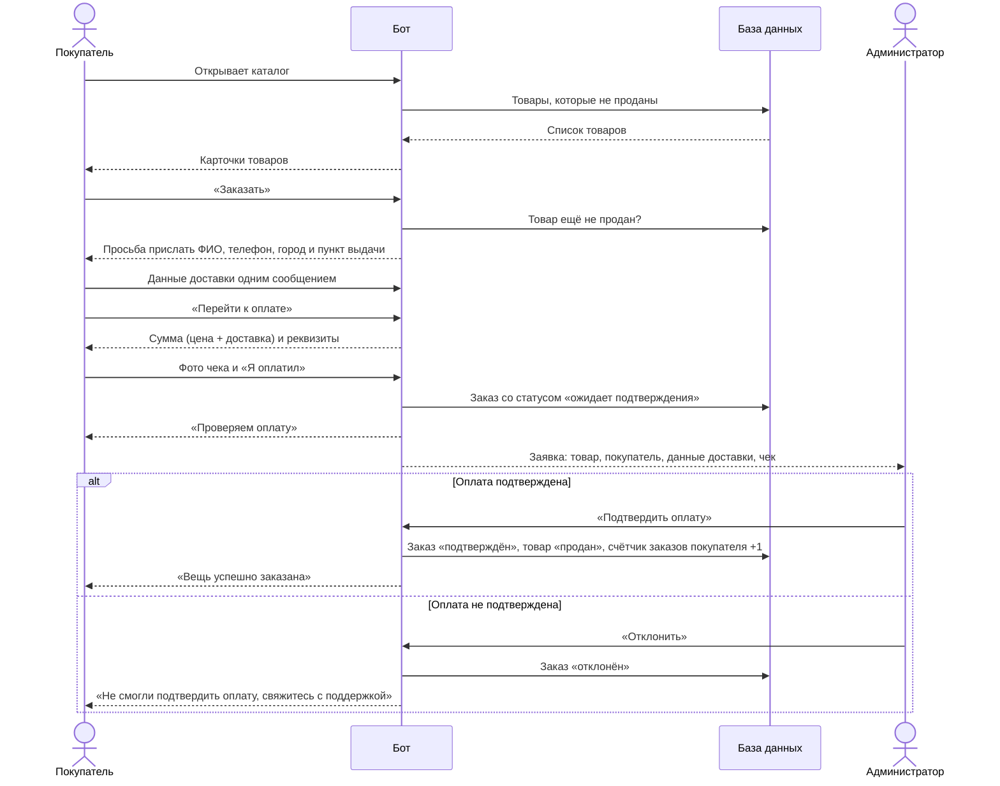
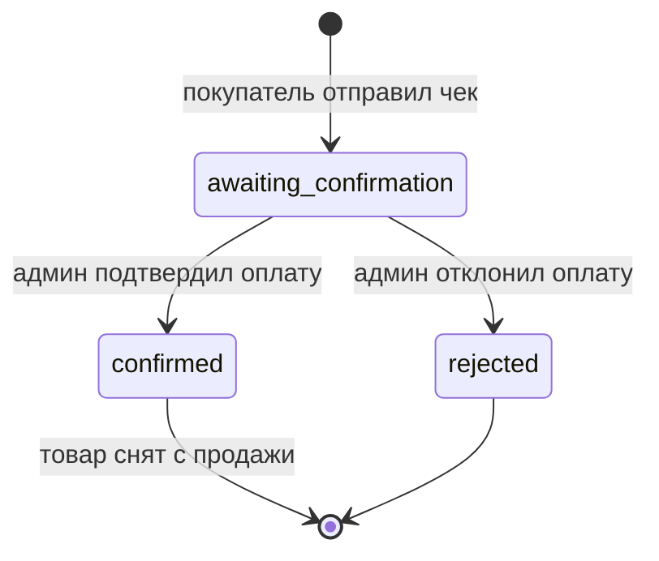
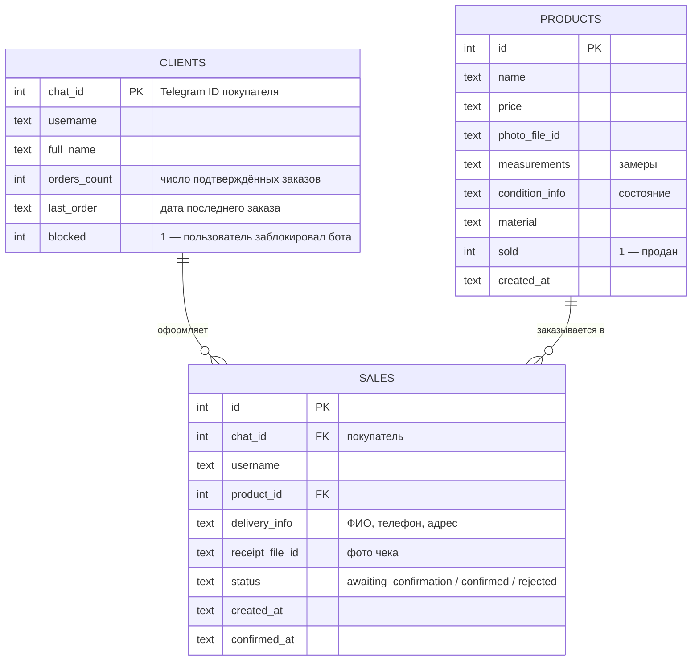

# Telegram-бот магазина одежды: кейс системного анализа

Аналитическая документация реального проекта: Telegram-бот, через который продавец одежды принимает заказы и оплату. Бот разработан и работает у заказчика (продавца на Авито). Название магазина, реквизиты и данные покупателей обезличены.

> Автор: Артём Клетчиков — студент 2 курса бизнес-информатики РТУ МИРЭА. В проекте выполнял весь цикл: сбор требований у заказчика, проектирование сценариев и базы данных, разработку, развёртывание и поддержку.

## 1. Задача бизнеса

**Как было:** продавец принимал заказы в личных сообщениях. Покупатели по многу раз спрашивали одно и то же (цену, замеры, состояние, реквизиты), заказы терялись в переписке, а проданные вещи приходилось вручную убирать из продажи.

**Что нужно:** один канал продаж, где покупатель сам смотрит каталог и оформляет заказ, а продавец получает готовую заявку с данными доставки и чеком об оплате.

**Цели:**
- убрать ручную переписку на каждом заказе;
- не допускать продажи одной вещи двум покупателям;
- видеть статистику продаж и иметь базу покупателей для рассылок.

## 2. Роли

| Роль | Кто это | Что делает в системе |
|---|---|---|
| Покупатель | Клиент магазина в Telegram | Смотрит каталог, оформляет заказ, оплачивает и отправляет чек |
| Администратор | Продавец (владелец магазина) | Ведёт каталог, проверяет оплату, смотрит статистику, делает рассылки |

## 3. Основные функции

**Покупатель**
- главное меню: каталог, отзывы (ссылка на канал отзывов), поддержка;
- карточка товара: фото, название, цена, замеры, состояние, материал;
- оформление заказа: ФИО, телефон, город и пункт выдачи одним сообщением;
- оплата по реквизитам (цена + фиксированная доставка) и отправка фото чека;
- уведомление о подтверждении или отклонении оплаты.

**Администратор** (команды видны только ему)
- пошаговое добавление товара: фото → название → цена → замеры → состояние → материал → подтверждение;
- список товаров и удаление с подтверждением;
- заявка о заказе с чеком и кнопками «Подтвердить» / «Отклонить»;
- статистика: покупатели, продажи за всё время, сегодня и за 7 дней, товары в наличии, топ-3 покупателя;
- рассылка всем покупателям с отчётом: доставлено, заблокировали бота, ошибки;
- выгрузка файла базы;
- перезапуск бота.

Подробные требования и пользовательские истории: [requirements.md](requirements.md).

## 4. Процесс оформления заказа

## 5. Жизненный цикл заказа

## 6. Модель данных

Покупатель попадает в таблицу `clients` только после подтверждённой покупки, поэтому рассылка уходит реальным покупателям, а не всем, кто открывал бота.

## 7. Ключевые решения

| Проблема | Решение | Почему так |
|---|---|---|
| Одну вещь могут купить двое | Перед заказом и перед оплатой бот проверяет, не продан ли товар; продажа фиксируется только после подтверждения оплаты | Пока оплата не проверена, продажа не считается состоявшейся |
| Чек может оказаться неверным | У заказа три статуса, админ может отклонить оплату, покупатель получает уведомление | Спорные случаи не теряются и не превращаются в продажу автоматически |
| Админ может случайно удалить товар | Удаление требует подтверждения | Дешёвая защита от ошибки, которую трудно отменить |
| Рассылка уходит тем, кто удалил бота | Такие пользователи помечаются при рассылке и исключаются из следующих | Меньше ошибок и честный отчёт о доставке |
| Потеря данных при сбое сервера | Автоматическая резервная копия базы раз в сутки, хранятся 14 последних | Можно восстановиться без ручных действий |
| Бот нужно быстро запускать для новых магазинов | Токен, ID администратора, название, реквизиты и контакт поддержки вынесены в файл настроек | Новый магазин подключается без изменения кода |

## 8. Технологии

Python, python-telegram-bot, Telegram Bot API, SQLite, Linux (Ubuntu), systemd.
